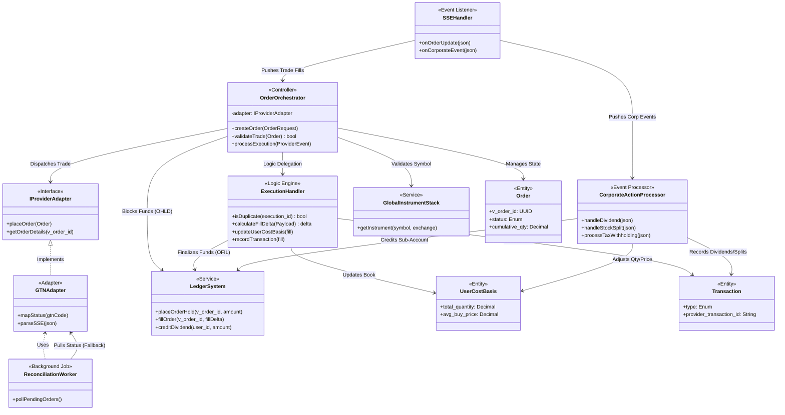

```mermaid
classDiagram
    direction TB

    %% Central Controllers and Logic
    class OrderOrchestrator {
        <<Controller>>
        -adapter: IProviderAdapter
        +createOrder(OrderRequest)
        +validateTrade(Order) bool
        +processExecution(ProviderEvent)
    }

    class ExecutionHandler {
        <<Logic Engine>>
        +isDuplicate(execution_id) bool
        +calculateFillDelta(Payload) delta
        +updateUserCostBasis(fill)
        +recordTransaction(fill)
    }

    class CorporateActionProcessor {
        <<Event Processor>>
        +handleDividend(json)
        +handleStockSplit(json)
        +processTaxWithholding(json)
    }

    %% Integration and Recovery
    class SSEHandler {
        <<Event Listener>>
        +onOrderUpdate(json)
        +onCorporateEvent(json)
    }

    class IProviderAdapter {
        <<Interface>>
        +placeOrder(Order)
        +getOrderDetails(v_order_id)
    }

    class GTNAdapter {
        <<Adapter>>
        +mapStatus(gtnCode)
        +parseSSE(json)
    }

    class ReconciliationWorker {
        <<Background Job>>
        +pollPendingOrders()
    }

    %% Core Services
    class GlobalInstrumentStack {
        <<Service>>
        +getInstrument(symbol, exchange)
    }

    class LedgerSystem {
        <<Service>>
        +placeOrderHold(v_order_id, amount)
        +fillOrder(v_order_id, fillDelta)
        +creditDividend(user_id, amount)
    }

    %% Data Entities
    class Order {
        <<Entity>>
        +v_order_id: UUID
        +status: Enum
        +cumulative_qty: Decimal
    }

    class UserCostBasis {
        <<Entity>>
        +total_quantity: Decimal
        +avg_buy_price: Decimal
    }

    class Transaction {
        <<Entity>>
        +type: Enum
        +provider_transaction_id: String
    }

    %% Relationships and Critical Connections
    
    %% Event Ingestion
    SSEHandler --> OrderOrchestrator : Pushes Trade Fills
    SSEHandler --> CorporateActionProcessor : Pushes Corp Events
    ReconciliationWorker --> GTNAdapter : Pulls Status (Fallback)
    
    %% Orchestration Flow
    OrderOrchestrator --> Order : Manages State
    OrderOrchestrator --> IProviderAdapter : Dispatches Trade
    OrderOrchestrator --> GlobalInstrumentStack : Validates Symbol
    OrderOrchestrator --> LedgerSystem : Blocks Funds (OHLD)
    OrderOrchestrator --> ExecutionHandler : Logic Delegation
    
    %% Implementation
    IProviderAdapter <|.. GTNAdapter : Implements
    GTNAdapter <.. ReconciliationWorker : Uses
    
    %% Post-Trade and Corporate Action Execution
    ExecutionHandler --> Transaction : Records Fills
    ExecutionHandler --> UserCostBasis : Updates Book
    ExecutionHandler --> LedgerSystem : Finalizes Funds (OFIL)
    
    CorporateActionProcessor --> Transaction : Records Dividends/Splits
    CorporateActionProcessor --> UserCostBasis : Adjusts Qty/Price
    CorporateActionProcessor --> LedgerSystem : Credits Sub-Account
```
