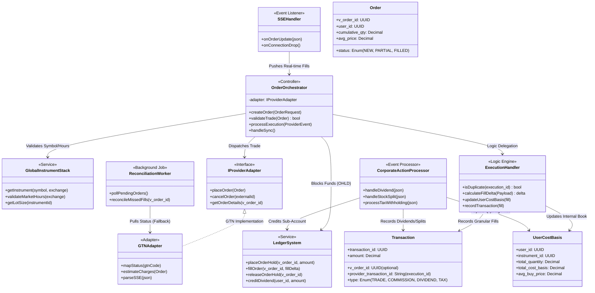

```mermaid
classDiagram
    direction TB

    %% --- External Systems & Infrastructure ---
    class GlobalInstrumentStack {
        <<Service>>
        +getInstrument(symbol, exchange)
        +validateMarketHours(exchange)
        +getLotSize(instrumentId)
    }

    class LedgerSystem {
        <<Service>>
        +placeOrderHold(v_order_id, amount)
        +fillOrder(v_order_id, fillDelta)
        +releaseOrderHold(v_order_id)
        +creditDividend(user_id, amount)
    }

    %% --- Core OMS Orchestration ---
    class OrderOrchestrator {
        <<Controller>>
        -adapter: IProviderAdapter
        +createOrder(OrderRequest)
        +validateTrade(Order) bool
        +processExecution(ProviderEvent)
        +handleSync()
    }

    class ExecutionHandler {
        <<Logic Engine>>
        +isDuplicate(execution_id) bool
        +calculateFillDelta(Payload) delta
        +updateUserCostBasis(fill)
        +recordTransaction(fill)
    }

    %% --- Integration & Resilience Layer ---
    class IProviderAdapter {
        <<Interface>>
        +placeOrder(Order)
        +cancelOrder(externalId)
        +getOrderDetails(v_order_id)
    }

    class GTNAdapter {
        <<Adapter>>
        +mapStatus(gtnCode)
        +estimateCharges(Order)
        +parseSSE(json)
    }

    class SSEHandler {
        <<Event Listener>>
        +onOrderUpdate(json)
        +onConnectionDrop()
    }

    class ReconciliationWorker {
        <<Background Job>>
        +pollPendingOrders()
        +reconcileMissedFills(v_order_id)
    }

    %% --- Non-Order Event Handling ---
    class CorporateActionProcessor {
        <<Event Processor>>
        +handleDividend(json)
        +handleStockSplit(json)
        +processTaxWithholding(json)
    }

    %% --- Unified Data Entities (Persistence) ---
    class Order {
        +v_order_id: UUID
        +user_id: UUID
        +status: Enum (NEW, PARTIAL, FILLED)
        +cumulative_qty: Decimal
        +avg_price: Decimal
    }

    class Transaction {
        +transaction_id: UUID
        +v_order_id: UUID (optional)
        +provider_transaction_id: String (execution_id)
        +type: Enum (TRADE, COMMISSION, DIVIDEND, TAX)
        +amount: Decimal
    }

    class UserCostBasis {
        +user_id: UUID
        +instrument_id: UUID
        +total_quantity: Decimal
        +total_cost_basis: Decimal
        +avg_buy_price: Decimal
    }

    %% --- Relationships & Flow ---
    OrderOrchestrator --> GlobalInstrumentStack : Validates Symbol/Hours
    OrderOrchestrator --> LedgerSystem : Blocks Funds (OHLD)
    OrderOrchestrator --> IProviderAdapter : Dispatches Trade
    IProviderAdapter <|.. GTNAdapter : GTN Implementation
    
    SSEHandler --> OrderOrchestrator : Pushes Real-time Fills
    ReconciliationWorker --> GTNAdapter : Pulls Status (Fallback)
    
    OrderOrchestrator --> ExecutionHandler : Logic Delegation
    ExecutionHandler --> Transaction : Records Granular Fills
    ExecutionHandler --> UserCostBasis : Updates Internal Book
    
    CorporateActionProcessor --> Transaction : Records Dividends/Splits
    CorporateActionProcessor --> UserCostBasis : Adjusts Qty/Avg Price
    CorporateActionProcessor --> LedgerSystem : Credits Sub-Account
```
